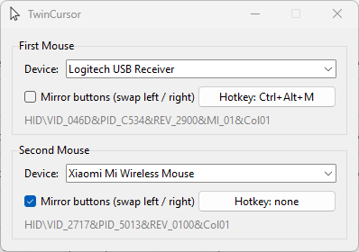

# TwinCursor

A dual-mouse, dual-cursor tool for Windows, designed for ambidextrous users.

TwinCursor lets two physical mice share one PC while each keeps its own cursor position. When you switch to the other mouse, the OS cursor jumps back to where that mouse left off, and a ghost cursor marks the idle mouse's position. While one mouse is dragging or actively moving, the other mouse moves its own ghost cursor instead of taking over (its clicks are ignored); control switches as soon as the first mouse pauses. A settings window provides a per-mouse "Mirror Buttons" toggle that swaps the left and right buttons, and a global hotkey per mouse to flip that toggle from the keyboard.

TwinCursor also works with a single mouse: set the second device slot to **None** and the app drops into a lightweight single-mouse mode — no input interception on the assigned mouse, no ghost cursor — where the mirror toggle (and its hotkey) simply swaps the buttons using the standard Windows API. Mice that are connected but not assigned to a slot are disabled entirely while the app runs.

The ghost cursor uses your actual system cursor (theme, pointer size and per-monitor DPI scaling are respected), drawn on a tiny per-pixel-alpha layered window.

## Screenshot



## Requirements

- Windows 10 or later
- One or two physical mice (the app waits up to 30 seconds for the first one at startup)
- [Interception](https://github.com/oblitum/Interception) kernel driver installed
- [uv](https://docs.astral.sh/uv/)

## Deployment

> Note: the deployment process is subject to change and will be reworked.

1. Install the [Interception](https://github.com/oblitum/Interception) driver and reboot.
2. Connect your mice.
3. Run the app:

```
uv run -m twincursor
```

On first run, uv automatically creates a virtual environment and installs the locked dependencies before starting the app.

To run with verbose logging:

```
uv run -m twincursor --debug
```

## Usage

- The app lives in the system tray. Left-click the tray icon (or right-click → **Open Settings**) to open the settings window.
- Each of the two slots (First Mouse / Second Mouse) has a **Device** dropdown listing the connected mice by product name. Pick which physical mouse fills each slot; the second slot can also be set to **None**. With both slots filled the app runs in dual-cursor mode; with one it runs in the simple single-mouse mode. Connected mice that are not assigned to a slot are disabled while the app runs.
- Toggle **Mirror buttons** per mouse to swap its left/right buttons.
- Click the **Hotkey** button to record a global keyboard shortcut that flips that mouse's mirror toggle; press Esc while recording to disable the hotkey. The first mouse defaults to `Ctrl+Alt+M`, the second to none.
- Settings are stored in the registry under `HKCU\SOFTWARE\TwinCursor`, keyed by mouse hardware ID.
- Right-click the tray icon → **Exit** to quit.
- Only one instance can run at a time; a second launch exits immediately.

## Project structure

- `twincursor/__main__.py` — entry point: DPI awareness, single-instance guard, app state, startup, shutdown
- `twincursor/router.py` — Interception event loop, stroke routing and mode switching (the input hot path)
- `twincursor/overlay.py` — ghost-cursor layered window
- `twincursor/settings_ui.py` — settings window (tkinter)
- `twincursor/tray.py` — system tray icon
- `twincursor/hotkeys.py` — global hotkeys (RegisterHotKey message loop)
- `twincursor/device_names.py` — human-readable device names via SetupAPI
- `twincursor/settings.py` — registry persistence
- `twincursor/winapi.py` — ctypes Win32 definitions
- `interception_python-1.13.5/` — vendored third-party library (do not modify)
